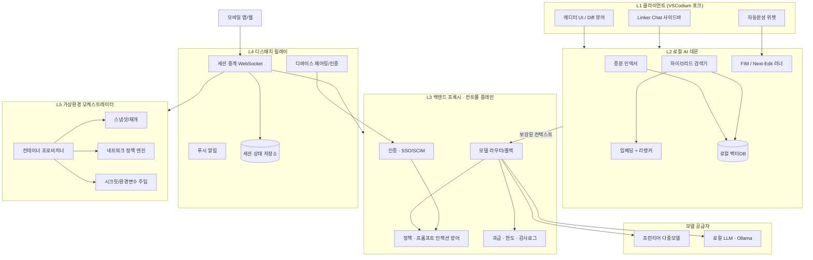
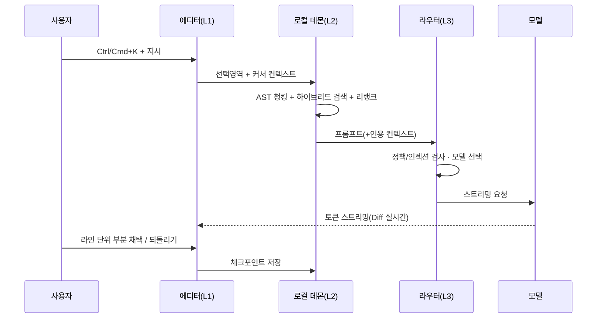
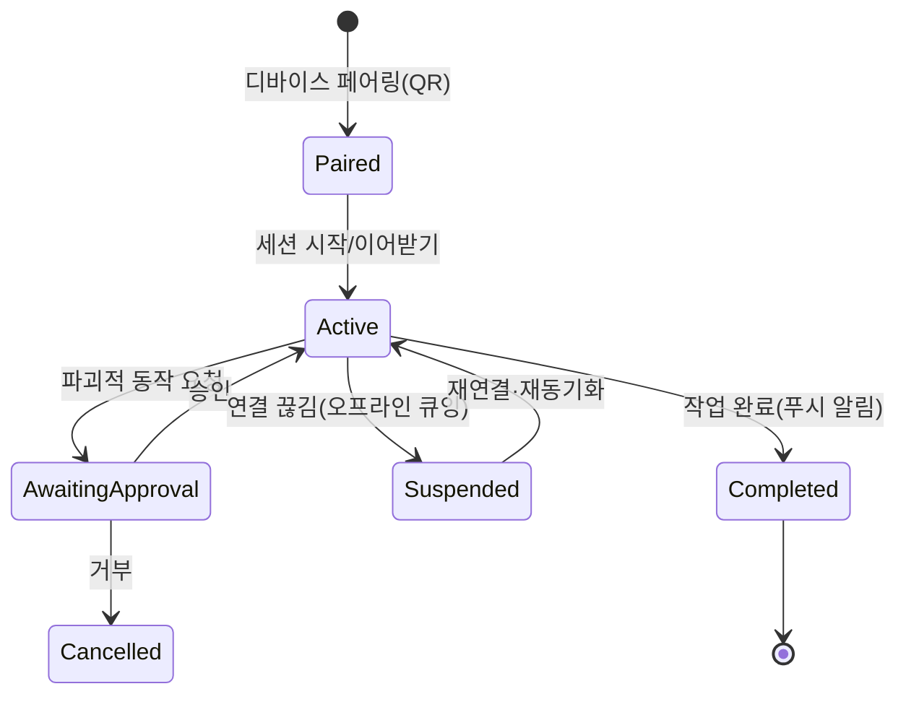
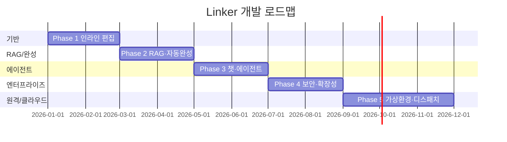

# Linker — AI 네이티브 코드 에디터 소프트웨어 요구사항 명세서 (SRS)

| 항목 | 내용 |
| --- | --- |
| 문서명 | Linker SRS (Software Requirements Specification) |
| 버전 | 2.0 (풀 리라이트 / Full Rewrite) |
| 상태 | Draft — 착수용(Ready for kickoff) |
| 언어 | 한국어 (기술용어 영문 병기) |
| 대상 독자 | 제품(PM)·엔지니어링·보안·플랫폼·QA·경영진 |
| 기준 시점 | 2026 |

> 본 문서는 오픈소스 **VSCodium** 포크 기반 AI 네이티브 코드 에디터 **Linker**의 요구사항을 정의한다.
> 원본 초안(5개 섹션: 개요 / 아키텍처·기술스택 / 기능요구사항 / 비기능요구사항 / 마일스톤)을 계승·확장하며,
> 원본의 모든 요구사항은 [부록 D. 원본→신규 매핑](#부록-d-원본신규-요구사항-매핑)에서 누락 없이 추적한다.

---

## 목차

1. [프로젝트 개요](#1-프로젝트-개요)
2. [제품 범위 & 설계 원칙](#2-제품-범위--설계-원칙)
3. [시스템 아키텍처](#3-시스템-아키텍처)
4. [핵심 기능 요구사항 (FR)](#4-핵심-기능-요구사항-fr)
5. [비기능 요구사항 (NFR)](#5-비기능-요구사항-nfr)
6. [데이터 모델 & 주요 API 계약](#6-데이터-모델--주요-api-계약)
7. [평가 & 테스트 전략](#7-평가--테스트-전략)
8. [리스크 & 완화 / 오픈 이슈](#8-리스크--완화--오픈-이슈)
9. [개발 마일스톤](#9-개발-마일스톤)
10. [부록](#10-부록)

---

## 1. 프로젝트 개요

### 1.1 비전 (Vision)
개발자가 **로컬 프라이버시를 지키면서도** 프런티어급 AI의 도움을 받아, 인라인 편집부터 멀티파일 에이전트 작업까지
끊김 없이 수행하고, **자리를 비운 상태에서도 모바일로 작업을 지시·감독**하며, **로컬 머신 없이 격리된 클라우드
환경에서 안전하게 코드를 실행**할 수 있는 AI 네이티브 에디터를 제공한다.

### 1.2 핵심 차별점 (Differentiators)
- **로컬 우선(Local-first)·모델 무관(Model-agnostic)**: 로컬 AI 데몬 + BYO-API-Key + 로컬 LLM(Ollama) 지원.
- **에이전트 네이티브(Agent-native)**: 인라인 편집을 넘어 계획-실행-검증 루프의 멀티파일 에이전트.
- **모바일 디스패치(Mobile Dispatch)**: 데스크톱/클라우드 세션을 모바일에서 시작·이어받기·승인.
- **가상 개발환경(Virtual Dev Environment)**: 에페메랄 컨테이너에서 저장소를 신선하게 클론해 격리 실행.
- **프라이버시 기본값(Privacy by default)**: 제로 데이터 리텐션·비학습 보장, 에어갭/온프렘 옵션.

### 1.3 대상 사용자 & 페르소나 (Personas)
| 페르소나 | 설명 | 핵심 니즈 |
| --- | --- | --- |
| P1. 개인 개발자 "지훈" | OSS·사이드 프로젝트 다수 | 빠른 인라인 편집, BYO-Key, 비용 통제 |
| P2. 시니어 엔지니어 "수아" | 대규모 모노레포 | 정확한 코드베이스 RAG, 멀티파일 에이전트, 회귀 안전성 |
| P3. 이동 중 리더 "민재" | 이동·회의 다수 | 모바일에서 작업 지시·리뷰·승인, 푸시 알림 |
| P4. 엔터프라이즈 보안담당 "은서" | 규제 산업 | 제로 리텐션, SSO/SCIM, 감사로그, 네트워크 정책 |
| P5. 플랫폼/DevOps "태오" | 팀 표준 환경 | 재현 가능한 Dev Container, 시크릿 주입, 할당량 |

### 1.4 성공지표 (Success Metrics)
- **북극성 지표(North Star)**
  - **제안 수락률(Suggestion Acceptance Rate)**: 채택된 AI 편집/완성 라인 ÷ 제시된 라인.
  - **일일 활성 사용시간(Daily Active Editing Time)**: 사용자당 AI 보조 편집 활성 시간.
- **보조 지표**: 주간 활성 사용자(WAU), 에이전트 작업 완료율, 세션당 되돌리기(rollback) 비율(낮을수록 좋음),
  모바일 디스패치 승인 응답 시간, 가상환경 세션 성공률, 토큰 비용/사용자.

### 1.5 용어집(요약)
전체는 [부록 A](#부록-a-용어집)에 있으며, 자주 쓰는 용어: **FIM**(Fill-in-the-Middle), **Next-Edit**(다음 편집 예측),
**RAG**(검색증강생성), **AST**(추상구문트리), **TTFT**(Time To First Token), **SLO**(서비스수준목표),
**에페메랄(Ephemeral)**, **디스패치(Dispatch)**, **컨트롤 플레인(Control Plane)**.

---

## 2. 제품 범위 & 설계 원칙

### 2.1 범위 (Scope)
**In scope**
- VSCodium 포크 클라이언트, 로컬 AI 데몬, 백엔드 프록시·컨트롤 플레인.
- 인라인 편집·RAG·챗·자동완성·에이전트 모드·모델 관리.
- 모바일 디스패치(앱/웹), 가상 개발환경 오케스트레이터.
- VS Code 확장 호환(Open VSX), 관측성·평가 하니스.

**Out of scope (v2)**
- 자체 파운데이션 모델 학습(외부 모델·로컬 모델 연동만).
- 완전 자율(무감독) 프로덕션 배포 자동화.
- 브라우저 전용(에디터 없는) SaaS 편집기.
- 실시간 다중 사용자 공동 편집(CRDT) — v3 후보.

### 2.2 설계 원칙 (Principles)
1. **로컬 우선**: 인덱스·임베딩·시크릿은 기본적으로 로컬에 상주. 원격은 옵트인.
2. **모델 무관**: 특정 벤더에 종속되지 않는 라우터·어댑터 계층.
3. **프라이버시 기본값**: 전송 최소화, 제로 리텐션 기본, Privacy Mode 스위치.
4. **점진적 신뢰(Progressive trust)**: 파괴적 동작(파일 쓰기·터미널·네트워크)은 승인 게이트.
5. **관측 가능성 내장**: 모든 AI 상호작용은 지표·트레이스로 계측(옵트아웃 가능).
6. **재현성**: 환경(Dev Container/Nix)·평가(골든셋)·빌드는 결정적으로 재현.

---

## 3. 시스템 아키텍처

### 3.1 계층형 구조 (Layered Architecture)
| 계층 | 컴포넌트 | 책임 |
| --- | --- | --- |
| L1 클라이언트 | VSCodium 포크(에디터 UI, 확장 호스트) | 편집 UX, Diff 뷰어, 챗/완성 UI |
| L2 로컬 AI 데몬 | 인덱서, 검색기, 임베딩/리랭커, FIM 러너 | 로컬 RAG·자동완성·캐시 |
| L3 백엔드 프록시·컨트롤 플레인 | 모델 라우터, 인증, 정책, 과금/한도, 감사 | 모델 폴백, 조직 정책, SSO/SCIM |
| L4 디스패치 릴레이 | 세션 중계, 페어링, 푸시, 상태 저장소 | 모바일↔데스크톱↔클라우드 중계 |
| L5 가상환경 오케스트레이터 | 컨테이너 프로비저너, 스냅샷, 네트워크 정책, 시크릿 주입 | 에페메랄 격리 실행환경 |

### 3.2 컴포넌트 다이어그램



### 3.3 데이터 흐름 (인라인 편집 예시)



### 3.4 모델 라우팅·폴백 전략 (Model Routing & Fallback)
- **라우팅 정책**: 작업 유형(완성/편집/챗/에이전트)·컨텍스트 길이·비용·지연·조직 정책으로 모델 선택.
- **폴백 사슬(Fallback chain)**: 1차(프런티어) → 2차(대체 벤더) → 3차(로컬 LLM) 순으로 자동 강등.
- **어댑터 계층**: 벤더별 차이를 표준 인터페이스로 추상화(스트리밍·툴콜·JSON 모드·토큰화).
- **캐싱**: 프롬프트 프리픽스/임베딩/완성 결과 캐시로 TTFT·비용 절감.

### 3.5 기술스택 현대화 (Technology Stack)
| 영역 | 채택(권장) | 대안/옵션 | 비고 |
| --- | --- | --- | --- |
| 클라이언트 | VSCodium 포크(Electron/TS) | — | VS Code 확장 호환 |
| 모델 계층 | 프런티어급 다중모델 라우터(모델 무관) | BYO-Key, 로컬 LLM(Ollama) | 특정 모델명 하드코딩 지양 |
| 임베딩 | 코드 특화 임베딩 + **리랭커(reranker)** | 다국어 코드 임베딩 | 검색 정확도 향상 |
| 벡터DB | **LanceDB**(로컬 임베디드) | Qdrant / Chroma | 로컬 우선, 서버 옵션 |
| 파서 | **tree-sitter**(다중언어 AST) | LSP 심볼 | AST 인식 청킹·심볼 그래프 |
| 검색 | 하이브리드(BM25 + 벡터 + 리랭크) | — | FR-2 참조 |
| 스트리밍/캐시 | SSE/WebSocket + 프롬프트 캐시 | — | TTFT SLO 충족 |
| 데몬 | 로컬 프로세스(gRPC/IPC) | — | 오프라인 동작 |

### 3.6 디스패치 릴레이 (Dispatch Relay)
모바일↔데스크톱↔클라우드 세션 중계. WebSocket 상시 연결 + 푸시(APNs/FCM) 이벤트. 세션 상태 저장소에
진행/승인/로그를 보존해 디바이스 간 이어받기(핸드오프)를 지원. 디바이스 페어링·인증 서비스가 토큰을 발급·회전.

### 3.7 가상환경 오케스트레이터 (Virtual Dev Environment Orchestrator)
세션 시작 시 저장소를 신선하게 클론한 **에페메랄 컨테이너**를 프로비저닝하고, 비활동 시 회수한다.
워크스페이스 스냅샷으로 재개, 네트워크 정책 엔진으로 아웃바운드 제어, 시크릿/환경변수를 안전 주입,
SessionStart 훅으로 셋업 스크립트를 실행한다. Dev Container/Nix로 재현성을 보장한다.

---

## 4. 핵심 기능 요구사항 (FR)

> 우선순위: **P0**(출시 필수) / **P1**(초기 중요) / **P2**(후속).
> 각 요구사항은 `FR-x.y` ID를 가지며 [부록 D](#부록-d-원본신규-요구사항-매핑)에서 원본과 대조된다.

### FR-1 인라인 편집 (Ctrl/Cmd+K)
| ID | 요구사항 | 우선 |
| --- | --- | --- |
| FR-1.1 | 선택영역/커서 컨텍스트 기반 자연어 편집 지시 | P0 |
| FR-1.2 | **Diff 뷰어**로 변경 전/후 시각화 | P0 |
| FR-1.3 | **라인 단위 부분 채택**(hunk/line accept-reject) | P0 |
| FR-1.4 | 토큰 **스트리밍 적용**(입력 중 실시간 반영) | P0 |
| FR-1.5 | **체크포인트/원클릭 되돌리기**(작업 단위 롤백) | P0 |
| FR-1.6 | 실패·중단 시 안전한 부분 적용/취소 | P1 |

### FR-2 코드베이스 RAG
| ID | 요구사항 | 우선 |
| --- | --- | --- |
| FR-2.1 | **AST 인식 청킹**(함수/클래스 경계 보존, tree-sitter) | P0 |
| FR-2.2 | **하이브리드 검색**(BM25 + 벡터 + **리랭커**) | P0 |
| FR-2.3 | **증분 인덱싱**(파일와처 + **Merkle 해시**로 변경분만) | P0 |
| FR-2.4 | **심볼 그래프 / 레포 맵**(정의·참조·의존) | P1 |
| FR-2.5 | **@ 멘션**(파일/심볼/폴더/문서 컨텍스트 첨부) | P0 |
| FR-2.6 | 인덱스 프라이버시(로컬 상주, .gitignore/secret 제외) | P0 |

### FR-3 사이드바 챗 (Linker Chat)
| ID | 요구사항 | 우선 |
| --- | --- | --- |
| FR-3.1 | 대화형 질의응답 + 코드 컨텍스트 인식 | P0 |
| FR-3.2 | **에디터 적용**(Apply to editor, Diff 경유) | P0 |
| FR-3.3 | **터미널 에러 연동**(에러 → 원인·수정 제안) | P1 |
| FR-3.4 | **인용(출처 파일:라인)** 표기 | P0 |
| FR-3.5 | 대화 히스토리·세션 저장/이어하기 | P1 |

### FR-4 스마트 자동완성
| ID | 요구사항 | 우선 |
| --- | --- | --- |
| FR-4.1 | **FIM**(Fill-in-the-Middle) 완성 | P0 |
| FR-4.2 | **다음 편집 예측(Next-Edit)**(연쇄 편집 제안) | P1 |
| FR-4.3 | **고스트 텍스트** 인라인 표시·부분 수락(단어/라인) | P0 |
| FR-4.4 | **캐싱·디바운싱**으로 지연·비용 최적화 | P0 |

### FR-5 (신규) 에이전트 모드
| ID | 요구사항 | 우선 |
| --- | --- | --- |
| FR-5.1 | **멀티파일 계획-실행**(plan → edit → verify 루프) | P0 |
| FR-5.2 | **툴 사용**(검색/파일 읽기·쓰기/테스트 실행/브라우저) | P0 |
| FR-5.3 | **승인형 터미널 명령 실행**(allowlist + 확인 게이트) | P0 |
| FR-5.4 | **반복 수정 루프**(테스트/린트 실패 시 자동 재시도, 상한) | P1 |
| FR-5.5 | 에이전트 실행의 체크포인트·전체 롤백 | P0 |
| FR-5.6 | 실행 계획·변경 요약을 사용자에게 사전 제시 | P1 |

### FR-6 (신규) 모델·설정 관리
| ID | 요구사항 | 우선 |
| --- | --- | --- |
| FR-6.1 | **모델 선택 UI**(작업별 기본 모델·프로필) | P0 |
| FR-6.2 | **BYO-API-Key**(로컬 안전 저장, OS 키체인) | P0 |
| FR-6.3 | **로컬 LLM(Ollama) 전환** 및 오프라인 모드 | P1 |
| FR-6.4 | 조직 정책으로 허용 모델·리텐션 강제 | P1 |

### FR-7 (신규·핵심) 모바일 디스패치 (Mobile Dispatch)
> Claude Code의 원격 디스패치 벤치마킹. 사용자가 자리를 비운 상태에서도 모바일에서 작업을 지시·중계.

| ID | 요구사항 | 우선 |
| --- | --- | --- |
| FR-7.1 | 모바일 → 데스크톱/클라우드 **세션 원격 시작·이어받기(핸드오프)** | P0 |
| FR-7.2 | **실시간 진행 모니터링**(로그·Diff·에이전트 단계) | P0 |
| FR-7.3 | **승인 요청·푸시 알림**(빌드 완료·질문·리뷰 대기) | P0 |
| FR-7.4 | **채팅형 지시**(모바일에서 자연어 태스크 발행) | P0 |
| FR-7.5 | **세션 상태 동기화**(디바이스 간 이어하기) | P0 |
| FR-7.6 | **페어링·QR 온보딩** | P1 |
| FR-7.7 | **안전한 원격 인증**(디바이스 토큰·재인증·만료) | P0 |
| FR-7.8 | **오프라인 큐잉**(연결 복구 시 재전송) | P1 |
| FR-7.9 | **예약 실행(트리거/루틴)**: 정해진 시각·이벤트에 자동 착수 | P2 |

### FR-8 (신규·핵심) 가상 개발환경 (Virtual Dev Environment)
> Claude Code on the web의 원격 실행환경 모델 벤치마킹. 로컬 머신 없이 격리된 클라우드/컨테이너 실행.

| ID | 요구사항 | 우선 |
| --- | --- | --- |
| FR-8.1 | 세션 시작 시 저장소 **신선 클론 + 에페메랄 컨테이너**(비활동 회수) | P0 |
| FR-8.2 | **세션 지속성·재개**, 워크스페이스 **스냅샷** | P0 |
| FR-8.3 | **네트워크 정책**(아웃바운드 프록시·화이트리스트·**에어갭 모드**) | P0 |
| FR-8.4 | **환경변수·시크릿 주입**(세션 스코프, 로그 마스킹) | P0 |
| FR-8.5 | **셋업 스크립트(SessionStart 훅)** 및 프리인스톨 툴체인(브라우저 등) | P1 |
| FR-8.6 | **리소스 격리·할당량**(디스크·CPU·시간) | P0 |
| FR-8.7 | **Dev Container/Nix 재현성** | P1 |
| FR-8.8 | **로컬 ↔ 원격 실행 전환**(동일 워크스페이스 뷰) | P1 |

---

## 5. 비기능 요구사항 (NFR)

### 5.1 성능 (Performance) — SLO
| ID | 지표 | 목표 |
| --- | --- | --- |
| NFR-1.1 | Ctrl/Cmd+K **TTFT** | p50 ≤ 500ms, **p95 ≤ 1s** |
| NFR-1.2 | 자동완성 표시 지연 | p95 ≤ 300ms(캐시 적중 시 ≤ 80ms) |
| NFR-1.3 | 챗 응답 TTFT | p95 ≤ 1.5s |
| NFR-1.4 | 백그라운드 **인덱싱 CPU 점유** | **≤ 15%**(사용자 상호작용 우선) |
| NFR-1.5 | 초기 인덱싱 처리량 | ≥ 5k 파일/분(로컬, 캐시 미적중 기준) |
| NFR-1.6 | 증분 재인덱싱 반영 | 저장 후 ≤ 2s |

### 5.2 보안·프라이버시 (Security & Privacy)
| ID | 요구사항 |
| --- | --- |
| NFR-2.1 | **제로 데이터 리텐션·비학습 보장**(기본값), 조직 정책으로 강제 |
| NFR-2.2 | **Privacy Mode**(원격 전송 차단, 로컬 전용) |
| NFR-2.3 | **에어갭/온프렘** 배포 옵션 |
| NFR-2.4 | **프롬프트 인젝션 방어**(컨텍스트 격리, 신뢰경계, 콘텐츠 검사) |
| NFR-2.5 | **시크릿 마스킹**(로그·프롬프트·전송에서 자격증명 제거) |
| NFR-2.6 | **감사로그**(모든 AI·툴·명령 실행 추적, 무결성) |
| NFR-2.7 | **SSO/SCIM**(SAML/OIDC, 자동 프로비저닝) |
| NFR-2.8 | **SOC 2 지향** 통제(접근·변경·모니터링) |

### 5.3 디스패치·가상환경 보안
| ID | 요구사항 |
| --- | --- |
| NFR-3.1 | **디바이스 인증·세션 격리·최소권한**(디스패치) |
| NFR-3.2 | **원격 명령 승인 게이트**(파괴적 동작 사용자 확인) |
| NFR-3.3 | **컨테이너 샌드박싱·리소스 할당량**(가상환경) |
| NFR-3.4 | **아웃바운드 네트워크 정책**(화이트리스트/에어갭) |
| NFR-3.5 | **원격 세션 감사추적**(누가·언제·무엇을 실행) |

### 5.4 신뢰성·관측성·비용
| ID | 요구사항 |
| --- | --- |
| NFR-4.1 | 컨트롤 플레인 **가용성 ≥ 99.9%**, 로컬 기능은 오프라인 동작 |
| NFR-4.2 | **텔레메트리(옵트아웃)**: 지표·트레이스·에러 리포팅 |
| NFR-4.3 | **토큰/비용 상한**(사용자·조직·세션 단위 한도·경고) |
| NFR-4.4 | 모델 폴백으로 단일 벤더 장애 시 연속성 |

### 5.5 확장성 (Extensibility)
| ID | 요구사항 |
| --- | --- |
| NFR-5.1 | **VS Code 확장 100% 호환**(확장 API·설정·테마) |
| NFR-5.2 | **Open VSX** 마켓플레이스 연동 |
| NFR-5.3 | 플러그인형 모델/도구/컨텍스트 공급자 인터페이스 |

---

## 6. 데이터 모델 & 주요 API 계약

### 6.1 인덱스 스키마 (개념)
```jsonc
// 코드 청크 레코드 (로컬 벡터DB)
{
  "chunk_id": "sha256(repo:path:symbol:start-end)",
  "repo": "string",
  "path": "src/foo/bar.ts",
  "language": "typescript",
  "symbol": "class Bar.method baz",     // AST 인식
  "start_line": 120, "end_line": 168,
  "content_hash": "merkle-node-hash",   // 증분 인덱싱
  "bm25_tokens": ["..."],
  "embedding": [/* code-embedding vector */],
  "updated_at": "iso8601"
}
```

### 6.2 핵심 엔드포인트 (스케치)
| 엔드포인트 | 목적 | 요청(요약) | 응답(요약) |
| --- | --- | --- | --- |
| `POST /v1/complete` | 자동완성(FIM/Next-Edit) | `{prefix, suffix, path, lang, cache_key}` | `stream<token>` |
| `POST /v1/edit` | 인라인 편집 | `{selection, instruction, context[], model?}` | `stream<diff-hunk>` |
| `POST /v1/chat` | 사이드바 챗 | `{messages[], context[], tools?}` | `stream<token \| tool_call>` |
| `POST /v1/index` | 인덱싱 트리거 | `{repo, changed_paths[], mode:"incremental"}` | `{indexed, skipped, took_ms}` |
| `POST /v1/retrieve` | 하이브리드 검색 | `{query, k, filters}` | `{chunks[], scores}` |
| `POST /v1/agent/run` | 에이전트 실행 | `{goal, tools[], approval:"gated"}` | `stream<step \| approval_request>` |
| `POST /v1/dispatch/session` | 원격 세션 시작/이어받기 | `{device_id, target:"desktop\|cloud", task}` | `{session_id, ws_url}` |
| `POST /v1/env/provision` | 가상환경 프로비저닝 | `{repo, snapshot_id?, network_policy, secrets_ref}` | `{env_id, status}` |

> 모든 엔드포인트는 인증 토큰·조직 정책·리텐션 헤더를 요구하며, 파괴적 동작은 승인 토큰을 추가로 요구한다.

### 6.3 디스패치 세션 상태 (개념)


---

## 7. 평가 & 테스트 전략

### 7.1 오프라인 평가 하니스 (Eval Harness)
- **골든셋(Golden set)**: 편집/완성/RAG/에이전트 태스크의 입력·기대결과 고정 세트.
- **지표**: 제안 **수락률**, 편집 **정확도**(diff 일치/테스트 통과), RAG **검색 적중률**(recall@k, MRR),
  에이전트 **작업 완료율**, 회귀 여부.
- **결정성**: 시드 고정·캐시 통제로 재현 가능한 비교.

### 7.2 A/B 및 온라인 실험
- 라우팅·프롬프트·리랭커 변경을 A/B로 검증(북극성 지표 기준).

### 7.3 회귀 테스트
- CI에서 골든셋 회귀 실행, 성능 SLO(TTFT 등) 벤치 회귀 게이트.

### 7.4 보안 테스트
- 프롬프트 인젝션 레드팀 스위트, 시크릿 유출 스캐너, 컨테이너 탈출/네트워크 정책 테스트.

---

## 8. 리스크 & 완화 / 오픈 이슈

| ID | 리스크 | 영향 | 완화 |
| --- | --- | --- | --- |
| R-1 | 모델 지연/비용 급증 | 성능·수익성 | 캐싱·라우팅·로컬 폴백·비용 상한(NFR-4.3) |
| R-2 | 프라이버시/규제 위반 | 신뢰·법적 | 제로 리텐션·에어갭·감사로그(NFR-2.x) |
| R-3 | 프롬프트 인젝션(악성 레포/문서) | 보안 | 신뢰경계·콘텐츠 검사·승인 게이트(NFR-2.4) |
| R-4 | 대형 모노레포 인덱싱 부하 | 성능 | 증분·Merkle·CPU 상한(FR-2.3/NFR-1.4) |
| R-5 | 원격 세션 오·남용 | 보안 | 디바이스 인증·최소권한·감사(NFR-3.x) |
| R-6 | 컨테이너 탈출/네트워크 유출 | 보안 | 샌드박싱·정책엔진·에어갭(NFR-3.3~3.4) |
| R-7 | VS Code 확장 호환성 회귀 | 채택 | 호환성 CI·Open VSX 검증(NFR-5.x) |

**오픈 이슈**: 실시간 공동 편집(CRDT) v3 편입 여부, 온프렘 모델 서빙 표준, 모바일 앱 스토어 정책 대응.

---

## 9. 개발 마일스톤

> 원본 4개 Phase를 계승하고 각 Phase에 **완료 기준(Acceptance Criteria)**·**측정 지표**를 부여했으며,
> 에이전트 모드·평가 하니스를 반영했다. **Phase 5(신규)**로 가상환경 오케스트레이터 + 모바일 디스패치를 추가한다.

### Phase 1 — 기반 & 인라인 편집 (원본 계승)
- 범위: VSCodium 포크, 로컬 데몬 골격, FR-1(인라인 편집), FR-6.1~6.2(모델 관리 기본), 관측성 v0.
- **완료 기준**: Ctrl+K 편집·Diff·부분 채택·되돌리기 동작; **NFR-1.1(TTFT p95 ≤ 1s)** 달성; 텔레메트리 계측.
- **지표**: 제안 수락률 초기 베이스라인 수립.

### Phase 2 — 코드베이스 RAG & 자동완성 (원본 계승)
- 범위: FR-2(AST·하이브리드·증분·심볼그래프·@멘션), FR-4(FIM·고스트·캐싱), 평가 하니스 v1(골든셋).
- **완료 기준**: recall@k·MRR 목표 달성; **NFR-1.4(인덱싱 CPU ≤ 15%)**·**NFR-1.6(≤ 2s 반영)**; 회귀 CI 가동.
- **지표**: RAG 적중률, 자동완성 수락률.

### Phase 3 — 챗 & 에이전트 모드 (원본 계승 + 신규)
- 범위: FR-3(챗·인용·터미널 연동), FR-5(에이전트: 계획-실행·툴·승인 명령·체크포인트).
- **완료 기준**: 멀티파일 에이전트가 골든셋 태스크 완료율 목표 달성; 파괴적 동작 승인 게이트·전체 롤백 검증.
- **지표**: 에이전트 완료율, 롤백 비율.

### Phase 4 — 엔터프라이즈·보안·확장성 (원본 계승 + 신규)
- 범위: NFR-2(제로 리텐션·Privacy Mode·인젝션 방어·감사·SSO/SCIM), NFR-5(VS Code 호환·Open VSX), FR-6.3~6.4.
- **완료 기준**: SSO/SCIM·감사로그·Privacy Mode 동작; 레드팀 스위트 통과; SOC 2 통제 매핑.
- **지표**: 보안 테스트 통과율, 엔터프라이즈 파일럿 승인.

### Phase 5 (신규) — 가상환경 오케스트레이터 + 모바일 디스패치
- 범위: FR-8(가상 개발환경: 에페메랄 컨테이너·스냅샷·네트워크 정책·시크릿·할당량·재현성),
  FR-7(모바일 디스패치: 원격 세션·모니터링·승인·푸시·핸드오프·페어링·예약 실행), NFR-3(디스패치·환경 보안).
- **완료 기준**: 모바일에서 세션 시작→모니터링→승인→완료 푸시 E2E; 저장소 신선 클론 격리 실행·비활동 회수;
  아웃바운드 정책·에어갭 모드·리소스 할당량 검증; 원격 세션 감사추적.
- **지표**: 디스패치 승인 응답 시간, 가상환경 세션 성공률, 회수 정확도.



---

## 10. 부록

### 부록 A. 용어집
| 용어 | 설명 |
| --- | --- |
| FIM (Fill-in-the-Middle) | 커서 전/후 컨텍스트로 가운데를 채우는 완성 |
| Next-Edit | 현재 편집에 이어질 다음 편집을 예측·제안 |
| RAG | 검색으로 컨텍스트를 보강해 생성 |
| AST | 추상구문트리, 코드 구조 표현 |
| 하이브리드 검색 | BM25(어휘) + 벡터(의미) + 리랭커 결합 |
| Merkle 해시 | 트리 해시로 변경분만 재계산(증분 인덱싱) |
| TTFT | 첫 토큰까지 시간 |
| SLO | 서비스수준목표(정량) |
| 에페메랄(Ephemeral) | 세션 종료·비활동 시 회수되는 일시적 자원 |
| 디스패치(Dispatch) | 원격(모바일)에서 작업을 지시·중계 |
| 컨트롤 플레인 | 정책·인증·라우팅을 담당하는 제어 계층 |
| 에어갭(Air-gap) | 외부 네트워크와 격리된 실행 |

### 부록 B. 오픈소스 라이선스 유의사항
- **VSCodium/Code - OSS**(MIT) 포크 시 상표·마켓플레이스 약관 준수(내장 MS 마켓플레이스 대신 **Open VSX**).
- tree-sitter(MIT), LanceDB/Qdrant/Chroma 각 라이선스 확인. 번들 모델·가중치의 사용 조건 검토.
- 제3자 모델 API 약관의 데이터 사용·리텐션 조항을 조직 정책(NFR-2.1)과 정합.

### 부록 C. 참고 아키텍처 (벤치마킹)
- **Cursor**: 인라인 편집·코드베이스 RAG·에이전트 UX.
- **Continue**: 오픈소스·모델 무관·확장 통합.
- **Aider**: 저장소 맵·CLI 에이전트·커밋 단위 편집.
- **Claude Code(원격 디스패치 / on the web)**: FR-7·FR-8의 원격 세션·클라우드 실행 벤치마킹.

### 부록 D. 원본→신규 요구사항 매핑
> 원본 5개 섹션이 신규 문서에 누락 없이 반영되었음을 추적한다.

| 원본 섹션 | 원본 항목 | 신규 위치 | 확장 내용 |
| --- | --- | --- | --- |
| 1. 개요 | 제품 개요 | §1 | 페르소나·성공지표·용어집 추가 |
| 2. 아키텍처·기술스택 | 구조·스택 | §3 | 계층형·Mermaid·라우팅/폴백·디스패치/가상환경 계층 추가; 모델·임베딩·벡터DB·AST 현대화 |
| 3.1 | 인라인 편집(Ctrl+K) | FR-1 | Diff·부분채택·스트리밍·체크포인트 세분화 |
| 3.2 | 코드베이스 RAG | FR-2 | AST 청킹·하이브리드·증분·심볼그래프·@멘션 |
| 3.3 | 사이드바 챗 | FR-3 | 에디터 적용·터미널 연동·인용 |
| 3.4 | 스마트 자동완성 | FR-4 | FIM·Next-Edit·고스트·캐싱 |
| (신규) | — | FR-5~FR-8 | 에이전트·모델관리·모바일 디스패치·가상 개발환경 |
| 4. 비기능 | 비기능 요구 | §5 | SLO·보안/프라이버시·디스패치/환경 보안·관측성·확장성 정량화 |
| 5. 마일스톤 | 4개 Phase | §9 | 완료기준·지표 부여 + Phase 5 신규 |

---

*문서 끝. 변경 이력은 PR 및 커밋 로그를 참조.*
